# 第1次作業題目-隨堂-HW1
>
>學號：113111114 
><br />
>姓名：黃品綾 
><br />
>作業撰寫時間：160 mins
><br />
>最後撰寫文件日期：2026/10/03 
>

本份文件包含以下主題：(至少需下面兩項，若是有多者可以自行新增)
- [x] 說明內容
- [x] 其他 (可以包含心得或是想跟老師反映)

## 說明內容
  1. 
圖檔事點連結進入到老師的倉庫後 找到右上角的fork點選
01 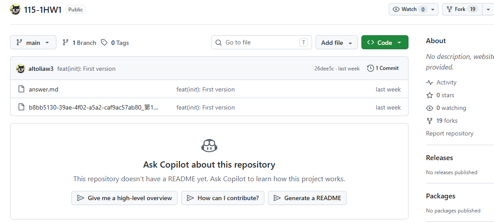

點選右下角create fork 
02 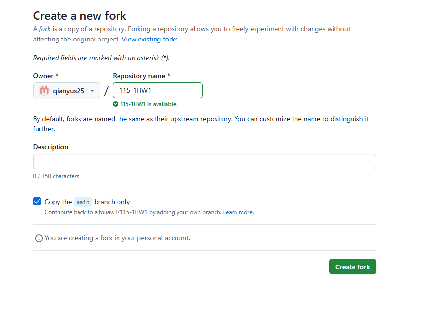

複製網址
03 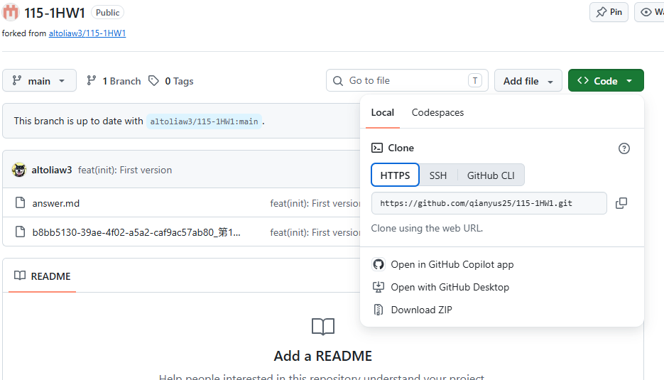

輸入圖檔內容
04 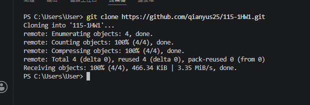

輸入完後就可以開啟檔案了，也可以找到檔案開啟
05 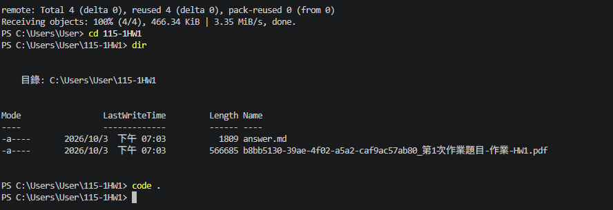

成功開啟檔案
06 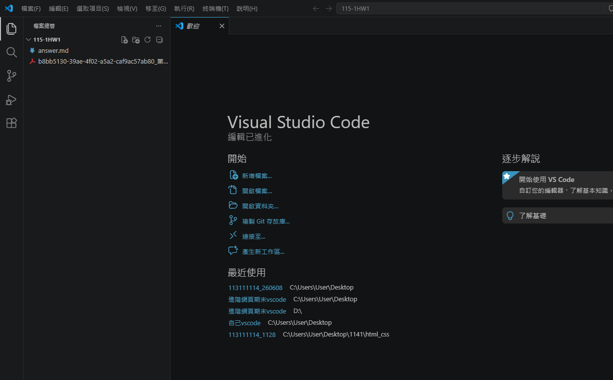

  2. 
1. 標題

使用# 可以建立標題，#的數量不同可以表示不同層級的標題。

Ans: 
# 標題字
## 次標題字
###### 小標題字

2. 粗體 斜線
使用**可將內容變成粗體
使用*可將內容變成斜線

Ans:
**粗體**
*斜線*

3. 無序清單 有序清單


Ans:
使用 - 可以建立無順序的清單。

Ans:
- 01
- 02
- 03

使用數字加上 . 可以建立有順序的清單。

Ans:
1. 01
2. 02
3. 03


5. 小區塊語法 大區塊語法
使用反引號 ` 來建立小區塊。
使用4個空格 來建立大區塊

Ans:
`通常用於一段相關內容的撰寫，一小段文字或是註釋都可能會用小區塊來表示`
    而篇幅較大又不希望與一般段落內容混在一起的文字，
    就會使用大區塊來包覆。
        

  6. 程式碼

使用三個反引號 ``` 可以顯示多行程式碼，也可以在後面指定程式語言。

Ans:

```javascript
console.log("Hello Git!");
```

7. 超連結

使用 `[文字](網址)` 可以建立超連結。

Ans:

```markdown
[GitHub](https://github.com/qianyus25/115-1HW1.git)

8. 圖片

使用  可以將圖片放入 Markdown 文件中。

Ans:

9. 分隔線

使用 --- 可以建立分隔線。

Ans:

---

10. 表格

使用 | 可以建立表格，並使用 --- 分隔標題與內容。

Ans:
|---|---|

  3. 查看目前有哪些分支 並建立一個新的分支 + 直接切換過去。
07 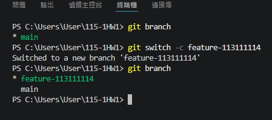 

新增hello.txt檔案
08 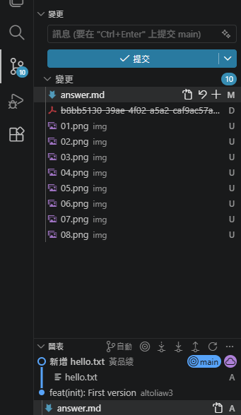

設定 Git 的名字 電子信箱
09 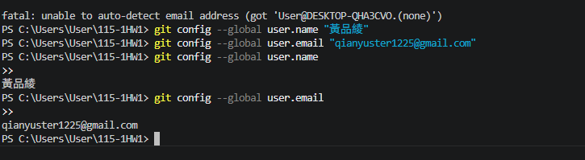

在自己的 feature 分支完成 hello.txt → commit → 合併到 main → 上傳 GitHub。
10 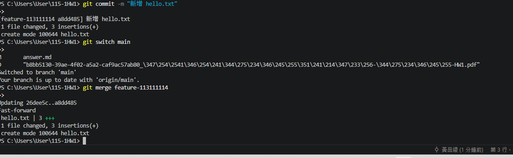

上傳檔案
12 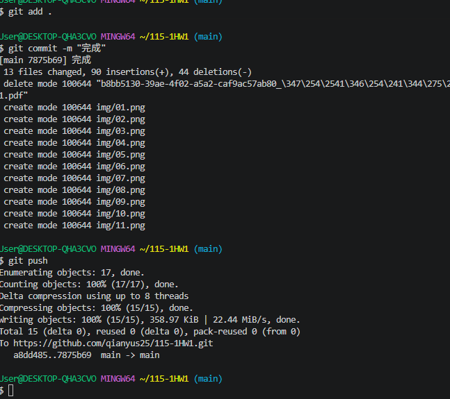


  4. 
11 
## 其他
